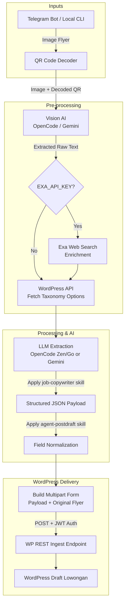

# WPLokerBJM Post Automation

Telegram and CLI automation for converting job vacancy flyers into structured
WordPress `lowongan` drafts.

The service:

- Reads flyer images with OpenCode Zen first, then OpenCode Go fallback.
- Decodes QR codes deterministically before AI extraction and passes the
  decoded content into the model context.
- Optionally enriches extraction context with Exa web search when `EXA_API_KEY`
  is configured.
- Loads current taxonomy options from WordPress before extraction.
- Applies the bundled `job-copywriter` and `agent-postdraft` skills.
- Normalizes fields to the WordPress ingest schema.
- Uploads the original flyer as the featured image.
- Runs as a Render Web Service with a Telegram webhook.

## Automation Flow



## Code Layout

`agent-telegram.py` is now only a compatibility wrapper around
`automation.main`. New code should live in the `automation/` package:

```text
automation/
  models.py              strict Pydantic contracts and AgentError
  config.py              env loading, path helpers, API key lookup
  skills.py              SKILL.md loading from upload, env path, or bundled files
  main.py                CLI orchestration and build_result()
  ai/                    prompt building, Gemini fallback, OpenCode extraction
  ai/opencode/           OpenCode clients, vision preprocessing, probes
  wordpress/             JWT auth, option fetching, multipart draft posting
  payload/               constants and payload normalization
  telegram/              auth, Bot API client, file download, handlers, server
```

The package exposes a console command:

```bash
uv run agent --help
```

## Requirements

- Python 3.14
- [`uv`](https://docs.astral.sh/uv/)
- OpenCode Zen or Go API key
- WordPress with the WPLokerBJM GraphQL JWT mutation and REST ingest endpoints
- Telegram bot token from BotFather

## Environment

Copy `.env.example` to `.env` for local development. On Render, add the same
values under **Environment**.

```env
WPLBJM_API_BASE_URL_PROD=https://wp.example.com
WPLBJM_WORDPRESS_DOMAIN=https://wp.example.com

WPLBJM_JWT_PROD=

WP_LOGIN_USERNAME=
WP_LOGIN_PASSWORD=

AI_PROVIDER=opencode
OPENCODE_API_KEY=
OPENCODE_ZEN_KEY=
OPENCODE_GO_KEY=
OPENCODE_MODEL_CHAIN=zen:mimo-v2.5-free:chat,go:minimax-m3:messages,go:mimo-v2.5:chat
OPENCODE_VISION_MODE=analyze
ALLOW_DIRECT_IMAGE_FALLBACK=1
ALLOW_GEMINI_FALLBACK=
GOOGLE_AI_STUDIO_KEY=
GEMINI_API_KEY=
GEMINI_MODEL=
EXA_API_KEY=
EXA_SEARCH_TYPE=auto
DISABLE_WEB_ENRICHMENT=

TELEGRAM_USERNAME=allowed_username_without_at
TELEGRAM_BOT_TOKEN=
TELEGRAM_WEBHOOK_SECRET=
PUBLIC_BASE_URL=

SKILL_MD_PATH=.agents/skills/agent-postdraft/SKILL.md
```

### Environment Notes

- `TELEGRAM_USERNAME` is the only Telegram username allowed to use the bot.
  It is read from env and cannot be changed through Telegram. Change it by
  updating the environment and redeploying.
- `TELEGRAM_WEBHOOK_SECRET` is compared with Telegram's
  `X-Telegram-Bot-Api-Secret-Token` header.
- `TELEGRAM_MEDIA_GROUP_DELAY_SECONDS` controls how long the bot waits for
  sibling items in one Telegram album. The default is `2`.
- `TELEGRAM_BULK_COMMAND_TTL_SECONDS` controls how long `/post_prod` is
  remembered for captionless album fragments from the same chat. The default
  is `90`.
- `PUBLIC_BASE_URL` is optional. When empty, the service automatically uses
  Render's `RENDER_EXTERNAL_URL`, then `RENDER_EXTERNAL_HOSTNAME`.
- Set `PUBLIC_BASE_URL` only when Telegram should use a custom public domain.
- `WPLBJM_JWT_PROD` is the fallback token for production options and posting.
- `WP_LOGIN_USERNAME` and `WP_LOGIN_PASSWORD` are optional fallbacks for
  `/refresh_jwt` when credentials are not included in the command.
- `WPLBJM_WORDPRESS_DOMAIN` is used by the GraphQL JWT mutation.
- `AI_PROVIDER` defaults to `opencode`. Set it to `gemini` only when you want
  to bypass OpenCode.
- `OPENCODE_MODEL_CHAIN` is a comma-separated fallback list in
  `provider:model:endpoint_style` format. The default tries Zen MiMo V2.5,
  then Go MiniMax M3, then Go MiMo V2.5. The list is shuffled for each flyer
  unless `--model` is provided.
- `OPENCODE_ZEN_KEY` is preferred for Zen requests, and `OPENCODE_GO_KEY` is
  preferred for Go requests. `OPENCODE_API_KEY` is still accepted as a shared
  fallback when one key works for both.
- `GOOGLE_AI_STUDIO_KEY` powers `opencode-vision`. The app maps it to
  `GOOGLE_API_KEY` at runtime when Google-specific env vars are not already
  set. Legacy `AI_STUDIO_KEY` is still accepted as a fallback.
- If your key comes from an OpenCode Go subscription, put it in
  `OPENCODE_GO_KEY`. If it comes from Zen billing, put it in
  `OPENCODE_ZEN_KEY`.
- `OPENCODE_VISION_MODE` controls the image preprocessor: `analyze` is the
  default, with `ocr` and `describe` available for troubleshooting.
- `ALLOW_DIRECT_IMAGE_FALLBACK=1` lets OpenCode receive the image directly
  when `opencode-vision` is rate-limited or unavailable. Set it to `0` to
  require the preprocessor.
- `ALLOW_GEMINI_FALLBACK=1` allows Gemini as the last fallback after all
  OpenCode attempts fail.
- `GEMINI_API_KEY` may be used instead of `GOOGLE_AI_STUDIO_KEY` when Gemini
  fallback or `AI_PROVIDER=gemini` is enabled.
- `GEMINI_MODEL` may override the Gemini default `gemini-2.5-flash`.
- `EXA_API_KEY` enables optional web search enrichment for website/address/map
  validation. It is not required.
- `EXA_SEARCH_TYPE` defaults to `auto`; use `fast` if latency matters more than
  search quality.
- `DISABLE_WEB_ENRICHMENT=1` disables Exa even when `EXA_API_KEY` is present.
- `opencode-vision` turns the flyer image into text first, so OpenCode Zen/Go
  models receive text-only requests instead of raw image payloads.

## Skill Loading

Skill instructions use this precedence:

1. A `SKILL.md` uploaded through Telegram.
2. The file configured by `SKILL_MD_PATH`.
3. Both bundled repository skills:
   - `.agents/skills/job-copywriter/SKILL.md`
   - `.agents/skills/agent-postdraft/SKILL.md`

`SKILL_MD_PATH` is a path, not Markdown content. Relative paths are resolved
from this repository directory.

A Telegram-uploaded skill is stored in process memory. It is cleared whenever
Render restarts or redeploys, after which the configured or bundled fallback is
used again.

## Local CLI

Install dependencies:

```bash
uv sync
```

Extract and preview a flyer without posting:

```bash
uv run agent path/to/flyer.webp
```

Run the focused Python tests:

```bash
uv run pytest
```

Validate deployment environment variables before starting the bot:

```bash
uv run agent --check-config
```

GitHub Actions runs the same checks in `.github/workflows/ci.yml`. In Render,
set the service auto-deploy behavior to **After CI Checks Pass** so production
deploys wait for the GitHub CI result.

Create a production WordPress draft:

```bash
uv run agent path/to/flyer.webp --post-prod
```

Preview mode returns a mock payload only. Posting to WordPress only occurs when
`--post-prod` is provided.

The old wrapper still works for existing deployments:

```bash
uv run python agent-telegram.py path/to/flyer.webp
```

## Render Deployment

Create a Render **Web Service** from this repository.

Recommended settings:

```text
Runtime: Python
Build Command: python -m pip install uv==0.11.19 && python -m uv sync --frozen
Start Command: .venv/bin/agent --serve
Health Check Path: /healthz
```

The server binds to `0.0.0.0` using Render's `PORT` environment variable.

The build command explicitly installs the same `uv` version used to create the
lockfile. Calling it as `python -m uv` bypasses Render's native `uv` wrapper,
which can occasionally exist without its underlying executable. The start
command runs the synchronized virtual environment directly and therefore does
not require `uv` at runtime.

Existing services may keep using
`.venv/bin/python agent-telegram.py --serve`; it delegates to the same
`automation.main` entry point.

After deployment, verify:

```bash
curl https://wplokerbjm-post-automation.onrender.com
```

Expected response:

```json
{
  "ok": true,
  "service": "wplokerbjm-post-automation",
  "public_url": "https://wplokerbjm-post-automation.onrender.com",
  "telegram_webhook_url": "https://wplokerbjm-post-automation.onrender.com/telegram/webhook"
}
```

## Telegram Setup

Create the bot through BotFather, then set `TELEGRAM_BOT_TOKEN`,
`TELEGRAM_USERNAME`, and `TELEGRAM_WEBHOOK_SECRET` in Render.

On startup, the service automatically reads Render's built-in
`RENDER_EXTERNAL_URL` and registers:

```text
https://YOUR-SERVICE.onrender.com/telegram/webhook
```

The webhook is refreshed automatically after every restart or deployment.
No Render URL environment variable needs to be entered during onboarding.

Manual registration is only needed for troubleshooting:

```bash
curl -X POST \
  "https://api.telegram.org/bot${TELEGRAM_BOT_TOKEN}/setWebhook" \
  -d "url=https://YOUR-SERVICE.onrender.com/telegram/webhook" \
  -d "secret_token=${TELEGRAM_WEBHOOK_SECRET}"
```

Check registration:

```bash
curl "https://api.telegram.org/bot${TELEGRAM_BOT_TOKEN}/getWebhookInfo"
```

## Telegram Commands

```text
/help
/status
/set_domain https://wp.example.com
/refresh_jwt <wordpress_username> <wordpress_password>
/set_jwt <wordpress_username> <wordpress_password>
/set_skill (caption on an attached SKILL.md document)
/reset_skill
/add_users @username1 @username2
/rm_users @username1 [@username2]
/reset_users
```

### Runtime Telegram Access

`TELEGRAM_USERNAME` remains the permanent primary owner configured through the
deployment environment. Only that owner can add to, selectively remove from,
or clear the runtime list of additional users:

```text
/add_users @editor_one @editor_two
/rm_users @editor_one
/reset_users
```

`/add_users` appends new users without removing existing entries. `/rm_users`
removes only the named users, while `/reset_users` clears all additional users.
Usernames may be separated by spaces or commas, are case-insensitive, and are
deduplicated. Runtime users can operate the bot but cannot change this access
list. The list is stored only in process memory and is cleared whenever the
service restarts or redeploys.

### Set or Refresh JWT

`/refresh_jwt` sends this GraphQL mutation to `{WordPress domain}/graphql`:

```graphql
mutation GetJWT($username: String, $password: String, $token: String) {
  jwt(username: $username, password: $password, token: $token)
}
```

The GraphQL field returns `ok`, while the actual token is extracted from the
`Set-Cookie: jwt-token=...` response header. The refreshed token is stored in
process memory and overrides env JWT values until the service restarts.

Avoid sending credentials in Telegram when possible. Configure
`WP_LOGIN_USERNAME` and `WP_LOGIN_PASSWORD`, then send:

```text
/refresh_jwt
```

### Upload a Skill

Send a UTF-8 Markdown document with `/set_skill` as its caption:

```text
/set_skill
```

Maximum upload size is 256 KB. Use `/reset_skill` to discard the runtime upload
and restore the env/repository fallback.

### Process Flyers

- Send an image without a caption to extract and preview a mock payload.
- Send an image with `/post_prod` as the caption to create a production draft.
- Add an optional instruction after the command when a flyer needs special
  handling, for example:

  ```text
  /post_prod Prefer the decoded QR URL as the application link
  ```

  The instruction can guide emphasis and extraction, but cannot override the
  WordPress payload contract, visible-evidence rules, or taxonomy restrictions.
- Images may be sent as Telegram photos or image documents.
- When sending a Telegram media group/album, put `/post_prod` and any custom
  instruction on one item. The bot waits briefly for the album and applies the
  directive to every image in the group.
- For large selections that Telegram may split into several albums, send
  `/post_prod [custom instruction]` as a standalone command first, then upload
  all images within 90 seconds. Captionless groups from that upload inherit the
  complete directive.

The bot returns mock payload JSON for previews, and WordPress draft information
only when `/post_prod` succeeds.

## WordPress Contract

Options:

```text
GET /wp-json/wplokerbjm/v1/lowongan/ingest/options
Authorization: Bearer <JWT>
```

Draft ingest:

```text
POST /wp-json/wplokerbjm/v1/lowongan/ingest
Authorization: Bearer <JWT>
Content-Type: multipart/form-data
```

Multipart fields:

```text
payload=<JSON string>
featured_image=<original flyer>
```

Automated payload rules include:

- Titles end with `| AI posted draft`.
- Missing flyer gender defaults to both `Pria` and `Wanita`.
- The reserved `perusahaan` taxonomy is omitted.
- Taxonomy values are validated against backend options.
- `social_media` uses the Meta Box cloned fieldset array shape.
- `source` records the local temporary or CLI image path.

Duplicate flyer hashes return HTTP `409` instead of creating another draft.

## Runtime Persistence

The following Telegram settings are runtime-only:

- WordPress domain set by `/set_domain`
- JWT refreshed by `/refresh_jwt`
- Uploaded `SKILL.md`
- Additional Telegram users set by `/add_users`

They reset when Render restarts or redeploys. Their env and repository values
remain the fallback source of truth.

## Security

- Keep all JWTs, API keys, bot tokens, and WordPress passwords in Render secrets.
- Never commit `.env`.
- Use a long random `TELEGRAM_WEBHOOK_SECRET`.
- The primary Telegram owner is restricted by exact `TELEGRAM_USERNAME`.
- Only the primary owner can manage temporary additional users.
- Changing the primary owner requires an env update and redeployment.
- The bot never includes JWT values in normal responses.
